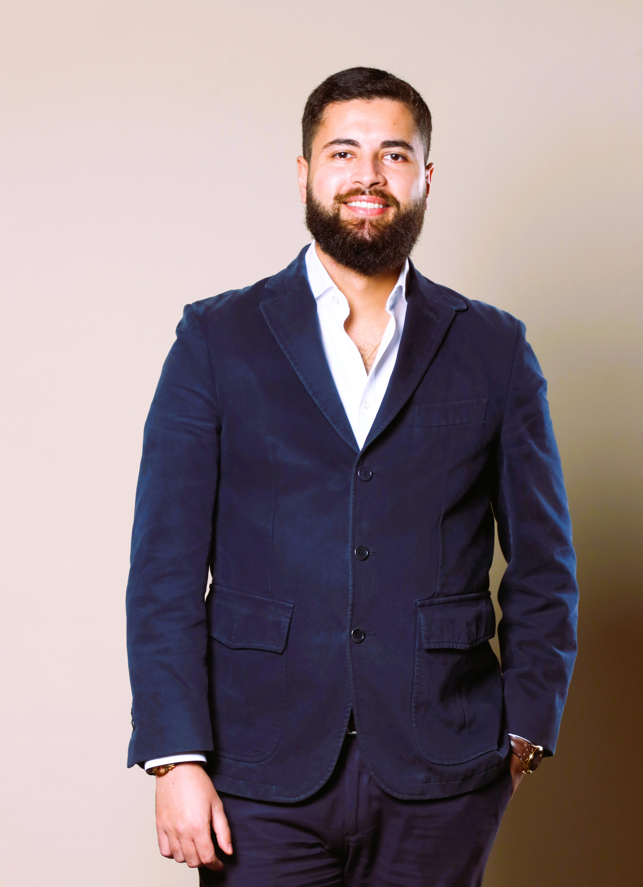

{: .profile-picture}

{: style="position: absolute; left: 240px; top: 750px; width: auto; height: 40px;"}
{: style="position: absolute; left: 290px; top: 750px; width: auto; height: 40px;"}
{: style="position: absolute; left: 340px; top: 750px; width: auto; height: 40px;"}
{: style="position: absolute; left: 390px; top: 750px; width: auto; height: 40px;"}

I am a finishing PhD student in Mathematics at the University of Oxford, supervised by Professor Samuel N. Cohen and Professor Álvaro Cartea, under the Ioan and Rosemary James scholarship.

My current research interests lie in statistical learning of point processes, and their applications to study high frequency financial data.

## Education
- PhD, Mathematics ( _University of Oxford_ )
- MSc, Mathematical & Computational Finance ( _University of Oxford_ )
- MEng, Applied Mathematics ( _Ecole Centrale Paris_ )
- Classes Preparatoires, Mathematics and Physics ( _Lycee Massena_ )
